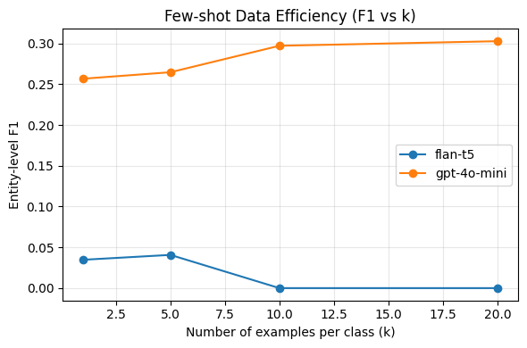

# Prompting Flan-T5 & ChatGPT（GPT-4o-mini）

## Prompt 设计

### ChatGPT（GPT-4o-mini）Prompt

> 在 ChatGPT（GPT-4o-mini）中使用较自然的指令式提示，因为该模型擅长理解开放式英文任务描述，并能根据上下文灵活输出结构化结果。

You are a medical information extraction assistant.
Task: Extract all medical entities mentioned in each clinical sentence below.
If no medical entity is found, output: Entity: None
Output them strictly after 'Entity:' separated by semicolons.
Do not add explanations or extra text.

Example 1:
Sentence: Coronary angiography done demonstrated significant lesions in the mid portion of the Left Descending Coronary Artery ( LAD ) and the proximal Circumflex Coronary Artery ( Cx ) .
Entity: lesions in the mid portion of the Left Descending Coronary Artery

Now analyze the following sentence:
Sentence:

### Flan-T5 Prompt

> 相比之下，Flan-T5 属于指令微调的 Seq2Seq 模型，需要更明确的输入输出格式，因此在 Prompt 中采用了“Input–Target”结构来强化格式一致性。

Instruction: Extract all medical entities from the input sentence.
If no medical entity is found, output: Entity: None
Format the output as: Entity: entity1; entity2; ...

Input: Coronary angiography done demonstrated significant lesions in the mid portion of the Left Descending Coronary Artery ( LAD ) and the proximal Circumflex Coronary Artery ( Cx ) .
Target: Entity: lesions in the mid portion of the Left Descending Coronary Artery

---

## 实验结果

| model        | k  | F1        | Precision | Recall  | Inference Time (s) |
|---------------|----|-----------|------------|----------|--------------------|
| flan-t5       | 1  | 0.0348    | 0.0368     | 0.0329   | 135.7 |
| flan-t5       | 5  | 0.0407    | 0.0456     | 0.0368   | 128.1 |
| flan-t5       | 10 | 0.0000    | 0.0000     | 0.0000   | 132.0 |
| flan-t5       | 20 | 0.0000    | 0.0000     | 0.0000   | 199.0 |
| gpt-4o-mini   | 1  | 0.2568    | 0.1566     | 0.7132   | 581.5 |
| gpt-4o-mini   | 5  | 0.2647    | 0.1610     | 0.7442   | 698.4 |
| gpt-4o-mini   | 10 | 0.2972    | 0.1855     | 0.7461   | 641.9 |
| gpt-4o-mini   | 20 | 0.3028    | 0.1906     | 0.7364   | 601.6 |

---

1. **Flan-T5 表现极低**  
   - 模型不擅长开放式实体抽取任务。  
   - few-shot 样例过多时输入被截断，导致输出不稳定。  
   - 当 k ≥ 10，模型输出几乎全部为 “Entity: None”。  

2. **GPT-4o-mini 表现稳定且提升明显**  
   - few-shot 学习效果好，F1 随 k 上升。  
   - Recall 高（≈0.7），说明识别覆盖广；Precision 稍低，说明有多余实体输出。  

3. **推理时间差距明显**  
   - Flan-T5 为本地 GPU 推理，速度快但能力有限。  
   - GPT-4o-mini 为远程 API 调用，推理慢但识别能力强。

# prototypical_networks

- 文件概览
  - `prototypical_networks.ipynb`：使用 BioBERT 作为编码器的原型网络（Prototypical Networks）NER。编码器参数参与微调，训练时在批内根据标签构造原型，评估/预测前基于训练集嵌入计算静态原型。除模型与损失外，其余流程与 `biobert_baseline.ipynb` 保持一致（CoNLL 读取、子词对齐、类别权重、训练参数、指标与输出）。
  - `prototypical_networks_baseline.ipynb`：冻结 BioBERT 编码器，只训练一个小的投影层（Linear + Tanh + LayerNorm）。训练与评估的原型构造逻辑与上面的原型网络版本一致；这样在 few-shot 场景下只学习头部投影，避免过拟合，同时沿用序列级 F1 作为主要指标。

- 核心逻辑
  - 数据与对齐：从 `conll/fewshot_k{K}_seed42_mention` 读取 `train/dev/test`，使用分词器对齐 BIO 标签，仅将词的首个子词打标签，其余子词标签记为 `-100` 并在损失中忽略。
  - 类别不均衡：统计训练集中标签频次，使用倒数归一化得到类权重，并适度下调 `O` 类权重；损失中配合 `ignore_index=-100` 与 label smoothing（0.1）。
  - 原型分类：以 token 表示到各类原型的负欧式距离作为 logits；训练阶段用批内标签构造原型，评估/预测阶段先用训练集整体表示计算“静态原型”再进行推断。
  - 训练参数：与 BioBERT baseline 对齐（默认 `lr=1e-5`、`batch_size=8`、`epochs=50`、`weight_decay=0.01`，禁用 wandb）。

- 两个版本的差异点
  - `prototypical_networks.ipynb`：编码器可训练（端到端微调），`proj` 为 Identity 或轻量映射；适合有一定样本且希望进一步适配域内数据。
  - `prototypical_networks_baseline.ipynb`：编码器冻结，仅训练小投影层（Linear + Tanh + LayerNorm），减少可训练参数，提升小样本下的稳定性与泛化。

- 路径与复现提示
  - 若在本地运行，按需将 `BASE` 改为项目根目录（如 `BASE = Path('.')`），并将 `DATA_DIR` 指向对应的 few-shot 目录（如 `fewshot_k1_seed42_mention`、`fewshot_k10_seed42_mention` 等）。输出会写入 `results/` 下对应子目录，包含 `metrics.json` 与控制台打印的 `classification_report`。

support：516
冷冻+微调投影头
| **K-shot** | **Validation F1** | **Precision** | **Recall** | **F1-score (Test)** | **Inference Time (s)** |
| ---------- | ----------------- | ------------- | ---------- | ------------------- | ---------------------- |
| **1**      | 0.6324            | 0.4667        | 0.9089     | 0.6167              | 161.9980               |
| **5**      | 0.6561            | 0.4789        | 0.9031     | 0.6259              | 162.0204               |
| **10**     | 0.6649            | 0.4785        | 0.9050     | 0.6260              | 162.8205               |
| **20**     | 0.6997            | 0.4704        | 0.9070     | 0.6195              | 162.3098               |

全冷冻
| **K-shot** | **Validation F1** | **Test Precision** | **Test Recall** | **Test F1-score** | **Inference Time (s)** |
| ---------- | ----------------- | ------------------ | --------------- | ----------------- | ---------------------- |
| **1**      | 0.6406            | 0.4800             | 0.9100          | 0.6247            | 143.5993               |
| **5**      | 0.6390            | 0.4800             | 0.9100          | 0.6239            | 143.3418               |
| **10**     | 0.6423            | 0.4800             | 0.9100          | 0.6252            | 142.2335               |
| **20**     | 0.6324            | 0.4700             | 0.9100          | 0.6190            | 142.0920               |

fine-tuned no frozen: k10 f1 0.49?

