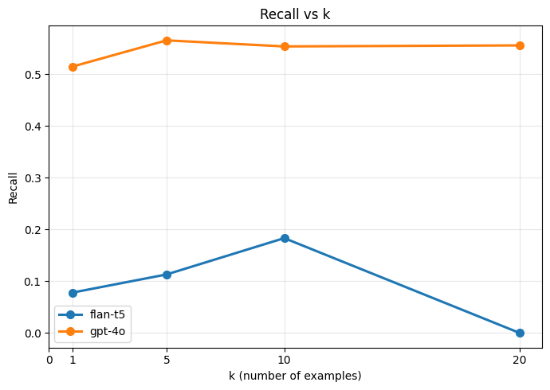
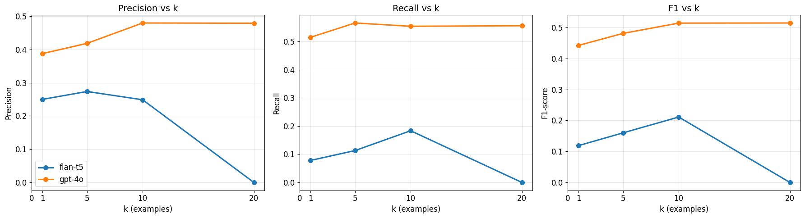
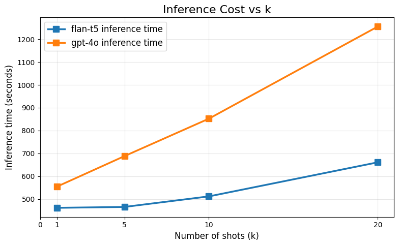
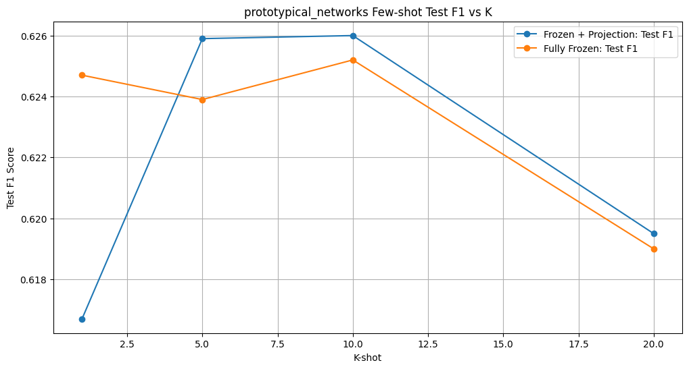

# Prompting：Flan-T5 与 ChatGPT（GPT-4o）

## Prompt 设计

### ChatGPT（GPT-4o）Prompt

> GPT-4o 属于强指令遵循（instruction-following）的 LLM，能够严格理解结构化规则与医学定义。因此 Prompt 采用“自然语言指令 + 严格规则 + JSON 输出格式”的 few-shot 设计。

You perform strict span-level extraction of clinical entities.  
All extracted spans must be labeled as type "ety".

"ety" refers ONLY to text spans that explicitly denote a clinical abnormality.  
It includes the following categories:
- diseases or diagnosable conditions
- symptoms or signs
- abnormal masses or structural abnormalities
- pathological exam/imaging/biopsy findings
- laboratory abnormalities
- infections or pathogen-related abnormalities
- clinical events such as bleeding, obstruction, necrosis

"ety" does NOT include:
- normal anatomy
- raw numbers or lab values without interpretation
- appearance descriptions (pale, weak)
- medications, treatments, procedures, or causes
- demographic, temporal, occupational, or contextual information

RULES:
- Extract ONLY spans appearing EXACTLY in the text.
- Do NOT infer, expand, merge, or paraphrase.
- Keep spans minimal but medically complete.
- Output MUST be a JSON array.
- Each entity must be an object: {"text": , "type": "ety"}.
- If no valid entities exist, output [].

Example:

Sentence: Coronary angiography done demonstrated significant lesions in the mid portion of the Left Descending Coronary Artery ( LAD ) and the proximal Circumflex Coronary Artery ( Cx ).  
[{"text": "lesions in the mid portion of the Left Descending Coronary Artery", "type": "ety"}]

Sentence:

---

### Flan-T5 Prompt

> Flan-T5 是指令微调后的 Seq2Seq 模型，不擅长生成严格 JSON，因此在 Prompt 中沿用相同的实体定义与规则，但将输出简化为半结构化文本格式（`e1; e2; e3`），以降低格式约束难度。

Extract clinical entities from the sentence.  
Only extract spans that explicitly describe an abnormal medical condition.

Valid entity types (all treated as "ety") include:
- diseases or medical diagnoses
- symptoms or signs of illness
- abnormal masses or structural abnormalities
- pathological exam, imaging, or biopsy findings
- laboratory abnormalities
- infections or pathogen-related abnormalities
- clinical events (bleeding, necrosis, obstruction)

NOT entities:
- normal anatomy
- raw numbers or lab values
- appearance descriptions (e.g., pale, weak)
- medications, procedures, or causes
- time, demographics, or contextual information

RULES:
- Copy spans EXACTLY from the sentence.
- Do NOT add, merge, guess, or paraphrase.
- If no valid entities exist, output: None  
Output format: e1; e2; e3

Example:

Sentence: Coronary angiography done demonstrated significant lesions in the mid portion of the Left Descending Coronary Artery ( LAD ) and the proximal Circumflex Coronary Artery ( Cx ).  
lesions in the mid portion of the Left Descending Coronary Artery

Sentence:

---

## 实验结果（基于最新数据）

| model   | k  | Precision | Recall  | F1        | Inference Time (s) |
|---------|----|-----------|----------|-----------|---------------------|
| flan-t5 | 1  | 0.2500    | 0.0780   | 0.1189    | 461.3 |
| flan-t5 | 5  | 0.2736    | 0.1131   | 0.1600    | 465.1 |
| flan-t5 | 10 | 0.2487    | 0.1832   | 0.2110    | 511.4 |
| flan-t5 | 20 | 0.0000    | 0.0000   | 0.0000    | 660.8 |
| gpt-4o  | 1  | 0.3877    | 0.5146   | 0.4422    | 554.0 |
| gpt-4o  | 5  | 0.4185    | 0.5653   | 0.4809    | 687.9 |
| gpt-4o  | 10 | 0.4797    | 0.5536   | **0.5140** | 852.2 |
| gpt-4o  | 20 | 0.4790    | 0.5556   | **0.5144** | 1256.1 |

  

  

---

## 结果分析（基于真实 Structured Prompt）

### 1. Flan-T5：无法稳定执行严格结构化抽取，且在 k=20 时完全崩溃
- 面对包含实体定义、排除项、RULES 的复杂 Prompt，Flan-T5 的 Seq2Seq 解码难以保持格式稳定。  
- 尽管 few-shot 提高了信息量，但模型缺乏 LLM 级别的 in-context 学习能力，因此 F1 仅从 0.12 → 0.21。  
- k=20 时 Prompt 长度超过最大输入窗口，**模型直接输出空结果（全部 None）**，F1=0。  
- 说明 Flan-T5 不能可靠处理长 Prompt，也难以遵守严格的 span-level extraction 规则。

---

### 2. GPT-4o：能充分利用结构化 Prompt，few-shot 效果显著
- GPT-4o 对“定义 + 规则 + exact span + JSON 输出”理解准确，能稳定执行结构化抽取。  
- few-shot 示例帮助模型快速建立抽取模式，F1 从 0.44 → **0.51** 持续提升。  
- k=10 与 k=20 的 F1 均约为 **0.514**，说明模型在样本足够后已“学满”，进入饱和状态。  
- Recall 保持在 **0.55+**，显示结构化提示有效减少漏报；Precision 稍低但稳定，反映部分“边界稍宽”。  

---

### 3. 推理时间呈现典型 Prompting 特点：随 k 增加显著上升
- GPT-4o 受 API 远程推理影响，时间从 554s → 1256s（k=1→20）。  
- Flan-T5 虽然更快，但性能不足且最终因输入超长而崩溃。  
- 整体趋势符合 Prompting 的典型 trade-off：  
  **无需训练 → 但推理成本随 Prompt 长度线性增长。**

---

## 总结

- **Flan-T5**  
  - 对严格结构化 Prompt 不够鲁棒  
  - few-shot 无明显提升  
  - 长 prompt 导致输入溢出，k=20 时完全失败  

- **GPT-4o**  
  - 能理解并严格遵守结构化提示  
  - few-shot 能力强，F1 在 k=10–20 稳定于 0.51  
  - 在小样本临床 NER 中表现出可靠的 span-level 抽取能力  

**结论：结构化 JSON Prompt + GPT-4o 是低资源临床实体识别中最稳定、最有效的 prompting 方案之一。**

---
# prototypical_networks

- 文件概览
  - `prototypical_networks.ipynb`：使用 BioBERT 作为编码器的原型网络（Prototypical Networks）NER。编码器参数参与微调，训练时在批内根据标签构造原型，评估/预测前基于训练集嵌入计算静态原型。除模型与损失外，其余流程与 `biobert_baseline.ipynb` 保持一致（CoNLL 读取、子词对齐、类别权重、训练参数、指标与输出）。
  - `prototypical_networks_baseline.ipynb`：冻结 BioBERT 编码器，只训练一个小的投影层（Linear + Tanh + LayerNorm）。训练与评估的原型构造逻辑与上面的原型网络版本一致；这样在 few-shot 场景下只学习头部投影，避免过拟合，同时沿用序列级 F1 作为主要指标。

- 核心逻辑
  - 数据与对齐：从 `conll/fewshot_k{K}_seed42_mention` 读取 `train/dev/test`，使用分词器对齐 BIO 标签，仅将词的首个子词打标签，其余子词标签记为 `-100` 并在损失中忽略。
  - 类别不均衡：统计训练集中标签频次，使用倒数归一化得到类权重，并适度下调 `O` 类权重；损失中配合 `ignore_index=-100` 与 label smoothing（0.1）。
  - 原型分类：以 token 表示到各类原型的负欧式距离作为 logits；训练阶段用批内标签构造原型，评估/预测阶段先用训练集整体表示计算“静态原型”再进行推断。
  - 训练参数：与 BioBERT baseline 对齐（默认 `lr=1e-5`、`batch_size=8`、`epochs=50`、`weight_decay=0.01`，禁用 wandb）。

- 两个版本的差异点
  - `prototypical_networks.ipynb`：编码器可训练（端到端微调），`proj` 为 Identity 或轻量映射；适合有一定样本且希望进一步适配域内数据。
  - `prototypical_networks_baseline.ipynb`：编码器冻结，仅训练小投影层（Linear + Tanh + LayerNorm），减少可训练参数，提升小样本下的稳定性与泛化。

- 路径与复现提示
  - 若在本地运行，按需将 `BASE` 改为项目根目录（如 `BASE = Path('.')`），并将 `DATA_DIR` 指向对应的 few-shot 目录（如 `fewshot_k1_seed42_mention`、`fewshot_k10_seed42_mention` 等）。输出会写入 `results/` 下对应子目录，包含 `metrics.json` 与控制台打印的 `classification_report`。

support：516
冷冻+微调投影头
| **K-shot** | **Validation F1** | **Precision** | **Recall** | **F1-score (Test)** | **Inference Time (s)** |
| ---------- | ----------------- | ------------- | ---------- | ------------------- | ---------------------- |
| **1**      | 0.6324            | 0.4667        | 0.9089     | 0.6167              | 161.9980               |
| **5**      | 0.6561            | 0.4789        | 0.9031     | 0.6259              | 162.0204               |
| **10**     | 0.6649            | 0.4785        | 0.9050     | 0.6260              | 162.8205               |
| **20**     | 0.6997            | 0.4704        | 0.9070     | 0.6195              | 162.3098               |

全冷冻
| **K-shot** | **Validation F1** | **Test Precision** | **Test Recall** | **Test F1-score** | **Inference Time (s)** |
| ---------- | ----------------- | ------------------ | --------------- | ----------------- | ---------------------- |
| **1**      | 0.6406            | 0.4800             | 0.9100          | 0.6247            | 143.5993               |
| **5**      | 0.6390            | 0.4800             | 0.9100          | 0.6239            | 143.3418               |
| **10**     | 0.6423            | 0.4800             | 0.9100          | 0.6252            | 142.2335               |
| **20**     | 0.6324            | 0.4700             | 0.9100          | 0.6190            | 142.0920               |

fine-tuned no frozen: k10 f1 0.49?

